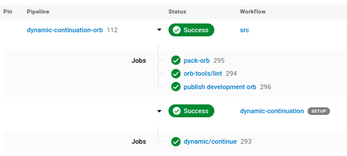

# CircleCI `dynamic-continuation` Orb

This orb allows the use of any number of configs under `.circleci/` that only run when there are code changes in coinciding directory paths. Directory-targeted dynamic pipelines offer engineers reduced execution time, and by extension, reduced CI costs.

<p align="center" width="100%">
  
</p>

This orb is based on a [published example](https://github.com/circle-makotom/circle-advanced-setup-workflow) of advanced configuration with continuations from CircleCI.

See my [article on Medium](https://medium.com/@ejd2385/dynamic-continuations-in-circleci-d7516ae5c6f2) about dynamic continuations for a simple introduction to using this orb.

## When will the orb run my workflows?

The orb will run a workflow (we'll call it `<module>`) if any of the following conditions are met.

1. If `.circleci/<module>.yml` changes (this is configurable).
2. If there have been no workflows on the repository's default branch in the past 90 days (by default, but [this is configurable](https://circleci.com/docs/api/v2/#operation/getProjectWorkflowMetrics)).
3. If changes have been detected within the `<module>/`'s directory on your branch against the repository's default branch (defaults to `master`). See [below](#filtering-or-ignoring-changed-files) on how to filter out CI runs from specific changed files.
4. If, following merge to the module's default branch, there are changes to `.circleci/<module>.yml` or under `<module>/`, when diffing against the former commit (you must perform a merge commit for this to work properly).

These conditions can be overridden, and all workflows forced to run, if the `force-all` parameter is set to `true` on the `continue` job.

## How it works

Get up-and-running with dynamically continued pipelines in these 4 steps:

1. Add this orb, a `continue` job to your CI config (`.circleci/config.yml`), and the `setup` keyword, such as

  ```shell
  setup: true

  orbs:
    dynamic: bjd2385/dynamic-continuation@<version>

  workflows:
    on-commit:
      jobs:
        - dynamic/continue:
            context: orb-publishing
            modules: |
              ... list of directories with corresponding config file names under '.circleci/'
  ```

2. Enable **setup workflows** in your project under **Advanced Settings**.

3. The `orb-publishing` context in your organization must have two environment variables set for the orb to reference, including
    - `CIRCLE_ORGANIZATION` (in my case, this is just set to `bjd2385`), and
    - `CIRCLE_TOKEN`, which contains your CircleCI API token.

4. Move any commands, jobs, workflows, or orbs, to their new configs in `.circleci`, and list corresponding modules in the `dynamic/continue` job.

### Example: basic directory layout

If you have a directory layout

```shell
.circleci/config.yml
terraform/
scripts/
src/
```

with the addition of this orb, a user could define targeted configs

```shell
.circleci/config.yml
.circleci/terraform.yml  # targets changes under the 'terraform/' directory
.circleci/scripts.yml    # targets changes under the 'scripts/' directory
.circleci/src.yml        # targets changes under the 'src/' directory
terraform/
scripts/
src/
```

The `dynamic/continue` workflow would look like

```yaml
setup: true

orbs:
  dynamic: bjd2385/dynamic-continuation@<version>

workflows:
  on-commit:
    jobs:
      - dynamic/continue:
          context: orb-publishing
          modules: |
            /terraform
            /scripts
            /src
```

Once again, the workflows will only execute if any code changes are introduced to the containing "module".

For example: if no changes are made on your branch within the `terraform/` directory, the `.circleci/terraform.yml` CI config will not be executed.

### Example: nested directories

Let's build off of the directory layout above, but add some environments.

```shell
.circleci/config.yml
terraform/
  development/
  production/
  staging/
scripts/
src/
  pkg1/
  pkg2/
```

We may write further targeted configs

```shell
.circleci/config.yml
.circleci/terraform.development.yml   # target specific changes under 'terraform/development/'
.circleci/terraform.production.yml    # target specific changes under 'terraform/production/'
.circleci/terraform.staging.yml       # target specific changes under 'terraform/staging/'
.circleci/scripts.yml
.circleci/src.pkg1.yml                # target specific changes under 'src/pkg1/'
.circleci/src.pkg2.yml                # target specific changes under 'src/pkg2/'
```

with a corresponding `dynamic/continue` workflow in our standard `config.yml`

```yaml
setup: true

orbs:
  dynamic: bjd2385/dynamic-continuation@<version>

workflows:
  on-commit:
    jobs:
      - dynamic/continue:
          context: orb-publishing
          modules: |
            /terraform/development
            /terraform/production
            /terraform/staging
            /scripts
            /src/pkg1
            /src/pkg2
```

Note that the filenames denote additional directory structure with dots `.`, whereas our modules may contain dots `.` or slashes `/`. Thus, the following list of modules is also valid, albeit potentially harder to follow.

```yaml
modules: |
  terraform.development
  terraform.production
  terraform.staging
  scripts
  src.pkg1
  src.pkg2
```

## Filtering or ignoring changed files

At times, there may be files that change in modules that should _not_ cause workflows to run. These could include, as an example, updated markdown or README-like files.

To solve this problem, the orb has the ability to read an optional `.gitignore`-like filter on each module, named `.circleci/<module>.ignore`, to prevent detected changed files on your PR from enabling workflows.

### Example

Starting with the same directory layout as above, we could add `.gitignore`-like files

```shell
.circleci/config.yml
.circleci/terraform.yml
.cirlceci/terraform.ignore  # optionally ignore changes under 'terraform/' directory
.circleci/scripts.yml
.cirlceci/scripts.ignore    # optionally ignore changes under 'scripts/' directory
.circleci/src.yml
.cirlceci/src.ignore        # optionally ignore changes under 'src/' directory
terraform/
scripts/
src/
```

These files are automatically referenced, and do not need to be explicitly specified, with a job as

```yaml
workflows:
  on-commit:
    jobs:
      - dynamic/continue:
          context: orb-publishing
          modules: |
            /src
            /terraform
            /scripts
```

or, exactly the same as above.

## Specifying a different workflow for your repository's root directory

It is possible to run a workflow targeting the root of a repository's directory structure, offering overlapping workflows and more flexibility on file changes when paired with the above strategies. We can accomplish this by specifying `.` or `/` as a module. For example,

```yaml
workflows:
  on-commit:
    jobs:
      - dynamic/continue:
          context: orb-publishing
          root-config: app  # Defaults to 'app.yml' and 'app.ignore' under .circleci/, should the orb detect a '.'- or '/'-root module
          modules: |
            /terraform
            /
```

Note that this requires you define an `app.yml` (though this root config's name is configurable), at  minimum, under `.circleci/`, for the orb to process.

## Config validation with `pre-commit`

Standard CircleCI config validation pre-commit hooks will only validate the default config at `.circleci/config.yml`. I recommend using [my pre-commit hook](https://github.com/bjd2385/circleci-config-pre-commit-hook) if you're using this orb in your project as it will validate any additional configs you've created. Append the following to your `.pre-commit-config.yaml`:

```yaml
- repo: https://github.com/bjd2385/circleci-config-pre-commit-hook
    rev: v<version>
    hooks:
      - id: circleci-config-validate
```

## Live Examples of dynamic-continuation

I use and test this orb in my own projects.

- [`minikube`](https://github.com/bjd2385/minikube/tree/master/.circleci) - this is a simple example with basic configs.
- [this repo](.circleci/) - that's right, this repo uses it as well!
- [`autoscaler`](https://github.com/bjd2385/autoscaler/tree/master/.circleci) - a complex example.

## Development

This orb has been developed in _unpacked_ form. You may view its packed source with

```shell
yarn orb:pack  # creates a file 'orb.yml'
```

Validate an orb definition with

```shell
yarn orb:validate
```

When you're done with development, you may clean up the packed source with

```shell
yarn orb:clean
```

### Publishing a production-ready version

To publish your changes to the CircleCI registry, simply merge your PR. The pipeline will automatically increment the minor tag, which will kick off a publication workflow; or, tag the repo manually.

### `pre-commit`

This repository uses `pre-commit` to uphold certain code styling and standards. You may install the hooks listed in [`.pre-commit-config.yaml`](.pre-commit-config.yaml) with

```shell
yarn install:pre-commit-hooks
```
